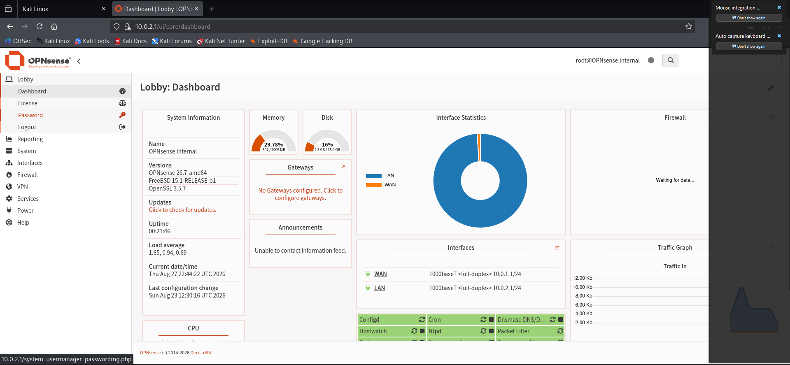
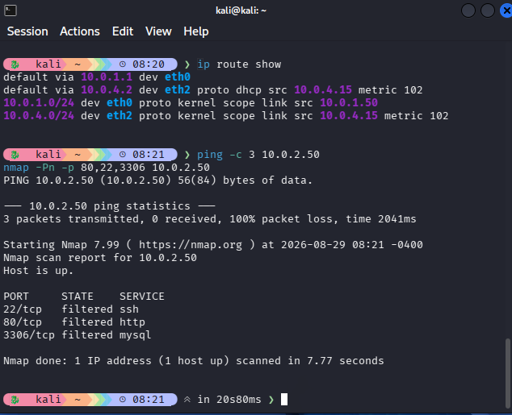
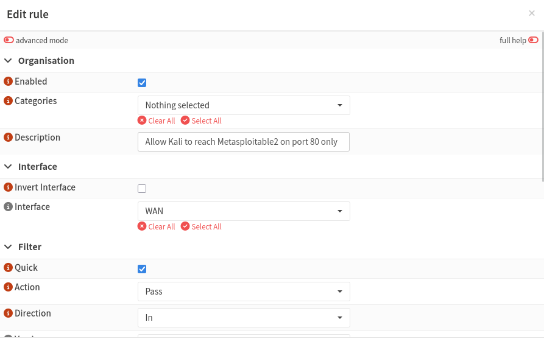
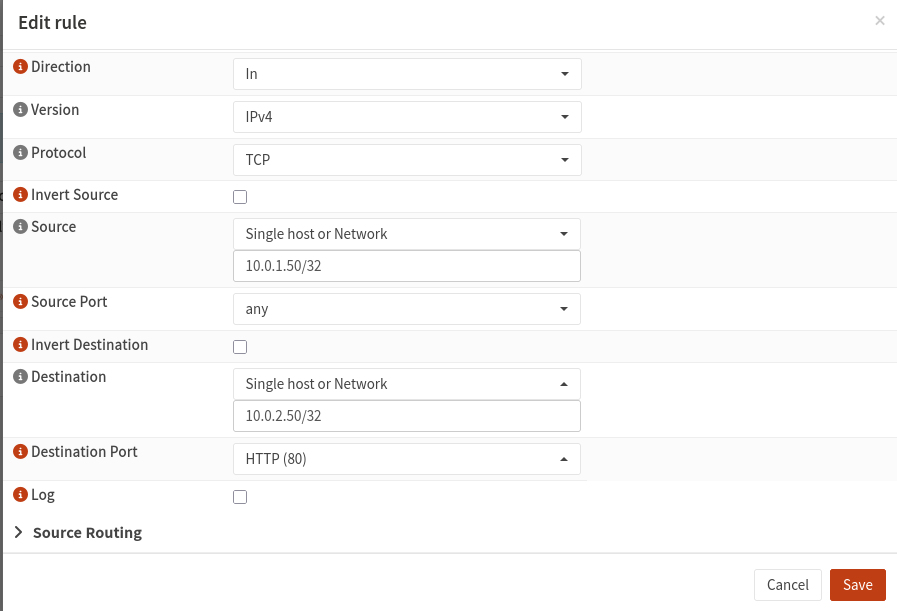
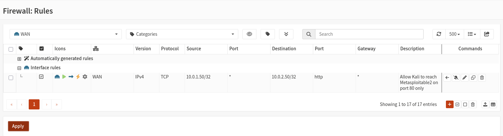

# Home Lab Network Segmentation with OPNsense

## Overview

This project demonstrates network segmentation using a firewall (OPNsense) placed between two isolated network segments in a VirtualBox home lab: an "attacker" segment (Kali Linux) and a "target" segment (Metasploitable2). Instead of both machines sitting on a flat, shared network where they can freely reach each other, OPNsense sits as the only bridge between them and enforces access with explicit firewall rules — the same core control pattern used in enterprise VLANs, DMZs, and zero-trust micro-segmentation.

**Goal:** Prove that (1) by default, nothing can cross between segments, and (2) once a specific rule is written, only that exact traffic is allowed through — everything else stays blocked.

## Topology

| Host | Segment | IP | VirtualBox Internal Network |
|---|---|---|---|
| Kali Linux (attacker) | WAN side | `10.0.1.50/24` | `intnet-attacker` |
| OPNsense (firewall) | Bridge | WAN: `10.0.1.1/24` · LAN: `10.0.2.1/24` | both |
| Metasploitable2 (target) | LAN side | `10.0.2.50/24` | `intnet-target` |

OPNsense's WAN interface faces Kali; its LAN interface faces Metasploitable2. No other path exists between the two segments — VirtualBox's "Internal Network" adapters create isolated virtual switches, so a VM only sees others explicitly attached to the same named network.



## Step 1: Default-deny baseline

With OPNsense installed and both interfaces addressed, but before any custom rule existed, Kali could not reach Metasploitable2 at all:
$ ping -c 3 10.0.2.50
--- 10.0.2.50 ping statistics ---
3 packets transmitted, 0 received, 100% packet loss

This confirms OPNsense's implicit default-deny rule blocks all inter-segment traffic until a rule explicitly allows it — the same default-deny behavior is visible again below in the Nmap scan run against all three test ports before the allow-rule was added:



## Step 2: Writing a least-privilege allow rule

A single rule was added on the WAN interface, permitting only Kali → Metasploitable2 on TCP port 80 (HTTP) — nothing else:

| Field | Value |
|---|---|
| Interface | WAN |
| Action | Pass |
| Protocol | TCP |
| Source | `10.0.1.50/32` |
| Destination | `10.0.2.50/32` |
| Destination port | 80 (HTTP) |





## Step 3: Validating the rule

**Port 80 — explicitly allowed:**
$ curl -v --interface eth0 http://10.0.2.50 --max-time 5

Trying 10.0.2.50:80...
Established connection to 10.0.2.50 (10.0.2.50 port 80) from 10.0.1.50 port 37418
< HTTP/1.1 200 OK
< Server: Apache/2.2.8 (Ubuntu) DAV/2
<html><head><title>Metasploitable2 - Linux</title></head>... * Connection #0 to host 10.0.2.50:80 left intact ```

A full HTTP 200 response — the allowed traffic passes cleanly through the firewall.

Ports 22 (SSH) and 3306 (MySQL) — not covered by any rule:
$ nmap -Pn -e eth0 -p 22,3306 10.0.2.50
PORT     STATE    SERVICE
22/tcp   filtered ssh
3306/tcp filtered mysql
Both fall through to the default-deny rule and are blocked, even though the same two hosts have an active, working path between them on port 80.
Result
Port	Expected	Actual	Result
80/tcp (HTTP)	Open	Open (HTTP 200)	✅ Pass
22/tcp (SSH)	Filtered	Filtered	✅ Pass
3306/tcp (MySQL)	Filtered	Filtered	✅ Pass
This confirms the firewall is enforcing least-privilege access between segments exactly as configured — not blocking everything, not allowing everything, but permitting only the specific traffic explicitly defined in the rule set.

Key troubleshooting notes

A few non-obvious issues came up while building this lab, worth noting for anyone reproducing it:

A second NIC on the same subnet bypasses the firewall entirely. A temporary management NIC added to Kali (for reaching OPNsense's web UI) sat on the same subnet as Metasploitable2, so Linux routed traffic to it directly over that NIC instead of through OPNsense's WAN interface — producing misleadingly "successful" pings that had nothing to do with the firewall. Bring that NIC down before testing segmentation.
NetworkManager silently reverts manual IP addressing. Static IPs set with ip addr add on Kali kept disappearing after reboots and interface toggles. Fixed by setting the interfaces to unmanaged: nmcli device set <iface> managed no.
Manual static IPs on Linux VMs don't persist across reboots unless configured through a persistent method (netplan/interfaces file) rather than one-off ip/ifconfig commands — expect to re-apply them after any VM restart.
Nmap's default ping-probe and ARP-probe can produce false "down"/"filtered" results on hosts that don't respond to ICMP or are on a directly-connected subnet. Use -Pn to skip the ping check, and confirm which interface traffic is actually leaving from (curl --interface <iface> or nmap -e <iface>).
Tools used
VirtualBox (Internal Network adapters for isolation)
OPNsense (firewall/router)
Kali Linux (attacker-segment host)
Metasploitable2 (target-segment host)
curl, nmap, ping for validation

One heads-up: your README has code blocks with triple-backticks inside it (the `ping`/`curl`/`nmap` outputs), and I wrapped the whole thing in triple-backticks too for this chat display — when you copy, make sure you copy from the line starting `# Home Lab Network Segmentation...` down to the last `- curl, nmap, ping for validation` line, **not** including my outer wrapper backticks.
